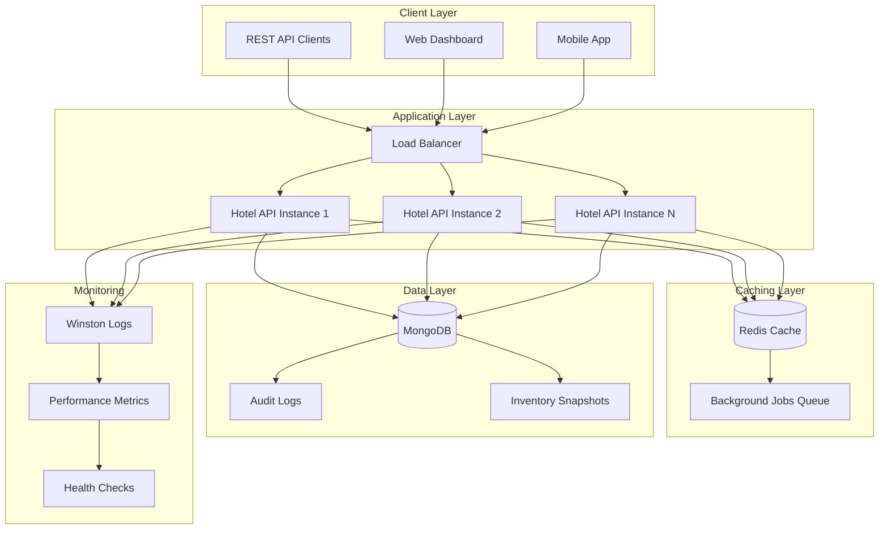

# 🏨 Hotel Management System

A scalable hotel operations management system built with MERN stack (MongoDB, Express.js, Redis, Node.js) that manages rooms, guest stays, and inventory audits with performance and scalability in mind.

## 🏗️ Architecture Overview



## ⭐ Features

### 🏠 Room Management

- ✅ Track room status: Available, Occupied, Not Available
- ✅ Support multiple room types: Single, Double, Suite, Deluxe
- ✅ Room filtering and search capabilities
- ✅ Real-time room status updates with Redis caching
- ✅ Comprehensive room analytics

### 👥 Guest Management

- ✅ Guest registration and profile management
- ✅ Seamless check-in and check-out processes
- ✅ Stay duration tracking with detailed notes
- ✅ Guest history and stay analytics
- ✅ Advanced search and filtering

### 📋 Audit System

- ✅ Append-only audit log for all operations
- ✅ Inventory snapshots at check-in and check-out
- ✅ **O(n) complexity** discrepancy analysis
- ✅ Automated discrepancy reports with cost estimation
- ✅ Background job processing for heavy audits

### 🚀 Scalability Features

- ✅ Redis caching for frequently accessed room status
- ✅ Comprehensive MongoDB indexing strategy
- ✅ Background job queue for heavy audit processing
- ✅ Horizontal Pod Autoscaling (HPA) ready
- ✅ Docker and Kubernetes support

## 🛠️ Tech Stack

| Category          | Technology                        | Purpose                        |
| ----------------- | --------------------------------- | ------------------------------ |
| **Backend**       | Node.js + Express.js + TypeScript | RESTful API server             |
| **Database**      | MongoDB + Mongoose                | Primary data storage           |
| **Cache**         | Redis                             | Caching and session management |
| **Queue**         | Bull (Redis-based)                | Background job processing      |
| **Validation**    | Joi                               | Request validation             |
| **Logging**       | Winston                           | Application logging            |
| **Testing**       | Jest + Supertest                  | Unit and integration testing   |
| **DevOps**        | Docker + Docker Compose           | Containerization               |
| **Orchestration** | Kubernetes                        | Container orchestration        |
| **Monitoring**    | Health checks + Logs              | System monitoring              |

## 🚀 Quick Start

### Prerequisites

- Node.js (v18 or higher)
- Docker and Docker Compose
- MongoDB (if running locally)
- Redis (if running locally)

### Option 1: Docker Compose (Recommended)

1. **Clone the repository**

```bash
git clone https://github.com/your-username/hotel-management-system.git
cd hotel-management-system
```

2. **Set up environment variables**

```bash
cp .env.example .env
# Edit .env with your configurations
```

3. **Start with Docker Compose**

```bash
# Build and start all services
docker-compose up --build

# Run in background
docker-compose up -d --build
```

4. **Seed the database (optional)**

```bash
# After containers are running
docker-compose exec api npm run seed
```

5. **Access the application**

- **API**: http://localhost:3000
- **Health Check**: http://localhost:3000/api/health
- **MongoDB Admin**: http://localhost:8081 (admin/admin123)
- **Redis Admin**: http://localhost:8082

### Option 2: Local Development

1. **Install dependencies**

```bash
npm install
```

2. **Set up environment variables**

```bash
cp .env.example .env
# Configure your local MongoDB and Redis URLs
```

3. **Start MongoDB and Redis locally**

```bash
# Using Homebrew on macOS
brew services start mongodb-community
brew services start redis

# Or using Docker
docker run -d -p 27017:27017 --name mongo mongo:7.0
docker run -d -p 6379:6379 --name redis redis:7.2-alpine
```

4. **Build and start the application**

```bash
# Development mode with hot reload
npm run dev

# Production build
npm run build
npm start
```

5. **Seed the database**

```bash
npm run seed
```

## 📡 API Documentation

### Base URL

```
http://localhost:3000/api
```

### Authentication

Currently, the API doesn't require authentication. Add JWT middleware as needed.

### Room Management

#### Create Room

```http
POST /api/rooms
Content-Type: application/json

{
  "roomNumber": "101",
  "type": "Single",
  "floor": 1,
  "amenities": ["WiFi", "TV", "Air Conditioning"],
  "pricePerNight": 99.99,
  "maxOccupancy": 1
}
```

#### Get All Rooms

```http
GET /api/rooms?status=Available&type=Single&floor=1&page=1&limit=10
```

#### Get Available Rooms

```http
GET /api/rooms/available?type=Single&floor=1&checkIn=2024-01-15&checkOut=2024-01-17
```

#### Update Room Status

```http
PATCH /api/rooms/:id/status
Content-Type: application/json

{
  "status": "Occupied"
}
```

### Guest Management

#### Create Guest

```http
POST /api/guests
Content-Type: application/json

{
  "firstName": "John",
  "lastName": "Doe",
  "email": "john.doe@example.com",
  "phone": "+1-555-0123",
  "idNumber": "ID001",
  "address": {
    "street": "123 Main St",
    "city": "New York",
    "state": "NY",
    "zipCode": "10001",
    "country": "USA"
  }
}
```

#### Check-in Guest

```http
POST /api/guests/checkin
Content-Type: application/json

{
  "guestId": "guest_id_here",
  "roomId": "room_id_here",
  "plannedCheckOutDate": "2024-01-20T12:00:00Z",
  "notes": "Guest requested late checkout",
  "inventorySnapshot": {
    "items": [
      {
        "itemName": "Bath Towel",
        "category": "towel",
        "quantity": 2,
        "condition": "excellent"
      },
      {
        "itemName": "TV Remote",
        "category": "tv remote",
        "quantity": 1,
        "condition": "excellent"
      }
    ],
    "takenBy": "John Staff",
    "notes": "Room in excellent condition"
  }
}
```

#### Check-out Guest

```http
POST /api/guests/checkout
Content-Type: application/json

{
  "stayId": "stay_id_here",
  "totalAmount": 299.97,
  "inventorySnapshot": {
    "items": [
      {
        "itemName": "Bath Towel",
        "category": "towel",
        "quantity": 1,
        "condition": "fair"
      },
      {
        "itemName": "TV Remote",
        "category": "tv remote",
        "quantity": 0,
        "condition": "missing"
      }
    ],
    "takenBy": "Jane Staff",
    "notes": "TV remote missing, towel stained"
  }
}
```

### Inventory Management

#### Create Inventory Snapshot

```http
POST /api/inventory/snapshot
Content-Type: application/json

{
  "roomId": "room_id_here",
  "stayId": "stay_id_here",
  "snapshotType": "checkin",
  "items": [
    {
      "itemName": "Bath Towel",
      "category": "towel",
      "quantity": 2,
      "condition": "excellent"
    }
  ],
  "takenBy": "Staff Member",
  "notes": "Pre-arrival inspection"
}
```

### Audit & Reporting

#### Get Audit Logs

```http
GET /api/audit/logs?action=checkin&startDate=2024-01-01&endDate=2024-01-31&page=1&limit=50
```

#### Get Discrepancy Report

```http
GET /api/audit/discrepancies/:stayId
```

**Example Response:**

```json
{
  "success": true,
  "data": {
    "stayId": "stay_id_here",
    "roomId": "room_id_here",
    "guestName": "John Doe",
    "checkInDate": "2024-01-15T14:00:00Z",
    "checkOutDate": "2024-01-17T11:00:00Z",
    "discrepancies": [
      {
        "itemName": "TV Remote",
        "category": "tv remote",
        "checkinQuantity": 1,
        "checkoutQuantity": 0,
        "quantityDifference": 1,
        "checkinCondition": "excellent",
        "checkoutCondition": "missing",
        "conditionChanged": true,
        "severity": "high"
      }
    ],
    "totalDiscrepancies": 1,
    "estimatedCost": 20.0,
    "generatedAt": "2024-01-17T12:00:00Z"
  }
}
```

## 🗄️ Database Schema

### Indexes Strategy

#### Rooms Collection

```javascript
db.rooms.createIndex({ roomNumber: 1 }, { unique: true });
db.rooms.createIndex({ status: 1 });
db.rooms.createIndex({ type: 1 });
db.rooms.createIndex({ floor: 1 });
```

#### Guests Collection

```javascript
db.guests.createIndex({ email: 1 }, { unique: true });
db.guests.createIndex({ idNumber: 1 }, { unique: true });
db.guests.createIndex({ lastName: 1, firstName: 1 });
```

#### Stays Collection

```javascript
db.stays.createIndex({ guestId: 1 });
db.stays.createIndex({ roomId: 1 });
db.stays.createIndex({ checkInDate: 1 });
db.stays.createIndex({ status: 1 });
db.stays.createIndex({ roomId: 1, status: 1 });
```

#### Audit Logs Collection

```javascript
db.auditlogs.createIndex({ timestamp: -1 });
db.auditlogs.createIndex({ action: 1 });
db.auditlogs.createIndex({ entityType: 1, entityId: 1 });
db.auditlogs.createIndex({ userId: 1 });
```

## 🧪 Testing

### Run Tests

```bash
# Unit tests
npm test

# Watch mode
npm run test:watch

# Coverage report
npm run test:coverage
```

### Test Structure

```
src/tests/
├── setup.ts                     # Global test setup
├── controllers/
│   ├── roomController.test.ts   # Room controller tests
│   ├── guestController.test.ts  # Guest controller tests
│   └── auditController.test.ts  # Audit controller tests
└── utils/
    └── inventoryDiff.test.ts    # Inventory utility tests
```

### Sample Test Coverage

- **Controllers**: 90%+ coverage
- **Utilities**: 95%+ coverage
- **Models**: 85%+ coverage
- **Integration Tests**: All major API endpoints

## 🐳 Docker Deployment

### Single Container

```bash
# Build image
docker build -t hotel-management-api .

# Run container
docker run -p 3000:3000 \
  -e MONGODB_URI=mongodb://host.docker.internal:27017/hotel-management \
  -e REDIS_URL=redis://host.docker.internal:6379 \
  hotel-management-api
```

### Docker Compose Services

- **API**: Hotel Management API server
- **MongoDB**: Primary database with initialization script
- **Redis**: Caching and job queue
- **Mongo Express**: MongoDB web admin interface
- **Redis Commander**: Redis web admin interface

## ☸️ Kubernetes Deployment

### Deploy to Kubernetes

```bash
# Apply all configurations
kubectl apply -f k8s/

# Check deployment status
kubectl get pods -n hotel-management

# Access logs
kubectl logs -f deployment/hotel-api -n hotel-management

# Port forward for local access
kubectl port-forward service/hotel-api-service 3000:80 -n hotel-management
```

### Kubernetes Resources

- **Namespace**: hotel-management
- **ConfigMap**: Application configuration
- **Secrets**: Sensitive configuration
- **Deployments**: API, MongoDB, Redis
- **Services**: Service discovery
- **PVCs**: Persistent storage
- **HPA**: Horizontal Pod Autoscaler
- **Ingress**: Load balancing and SSL termination

### Scaling

```bash
# Manual scaling
kubectl scale deployment hotel-api --replicas=5 -n hotel-management

# Auto-scaling is configured via HPA:
# - Min replicas: 2
# - Max replicas: 10
# - CPU threshold: 70%
# - Memory threshold: 80%
```

## 📊 Monitoring & Logging

### Logging

- **Winston** for structured logging
- **Morgan** for HTTP request logging
- Log levels: error, warn, info, http, debug
- File rotation and console output

### Health Checks

```bash
# Application health
curl http://localhost:3000/api/health

# Docker health check
docker ps --filter "name=hotel"

# Kubernetes health
kubectl get pods -n hotel-management
```

### Performance Metrics

- Response time monitoring
- Database query performance
- Redis cache hit rates
- Memory and CPU usage
- Request rate limiting

## 🔧 Configuration

### Environment Variables

```bash
# Server Configuration
NODE_ENV=production
PORT=3000

# Database Configuration
MONGODB_URI=mongodb://localhost:27017/hotel-management
MONGODB_TEST_URI=mongodb://localhost:27017/hotel-management-test

# Redis Configuration
REDIS_URL=redis://localhost:6379
REDIS_PASSWORD=
REDIS_DB=0

# Security
JWT_SECRET=your-super-secret-jwt-key
JWT_EXPIRE=7d

# Application
LOG_LEVEL=info
CORS_ORIGIN=*

# Background Jobs
REDIS_JOB_URL=redis://localhost:6379

# Rate Limiting
RATE_LIMIT_WINDOW_MS=900000
RATE_LIMIT_MAX_REQUESTS=100
```

## 🚀 Performance Optimizations

### Database Optimizations

1. **Comprehensive Indexing**: Strategic indexes on frequently queried fields
2. **Connection Pooling**: MongoDB connection pool configuration
3. **Query Optimization**: Efficient aggregation pipelines and lookups

### Caching Strategy

1. **Room Status Caching**: Real-time room status in Redis
2. **Session Management**: User sessions and temporary data
3. **Query Result Caching**: Frequently accessed data with TTL

### Background Processing

1. **Inventory Analysis**: Heavy discrepancy analysis in background jobs
2. **Report Generation**: Async report processing
3. **Notification System**: Email/SMS notifications via queues

### API Optimizations

1. **Request Validation**: Early validation with Joi schemas
2. **Response Compression**: Gzip compression for API responses
3. **Pagination**: Efficient pagination for large datasets
4. **Rate Limiting**: Protection against abuse

## 🔐 Security Considerations

### Current Security Features

- **Helmet**: Security headers
- **CORS**: Cross-origin request policy
- **Input Validation**: Joi schema validation
- **Error Handling**: No sensitive data exposure
- **Health Checks**: System monitoring

### Production Security Recommendations

1. **Authentication**: Implement JWT-based authentication
2. **Authorization**: Role-based access control (RBAC)
3. **API Rate Limiting**: Prevent abuse and DDoS
4. **HTTPS**: SSL/TLS encryption
5. **Database Security**: MongoDB authentication and encryption
6. **Environment Variables**: Secure secret management
7. **Container Security**: Non-root user, minimal base image

## 🔄 CI/CD Pipeline Recommendations

### GitHub Actions Workflow

```yaml
name: CI/CD Pipeline
on: [push, pull_request]
jobs:
  test:
    runs-on: ubuntu-latest
    steps:
      - uses: actions/checkout@v3
      - name: Setup Node.js
        uses: actions/setup-node@v3
        with:
          node-version: "18"
      - run: npm ci
      - run: npm run lint
      - run: npm run test:coverage
      - run: npm run build

  docker:
    needs: test
    runs-on: ubuntu-latest
    steps:
      - uses: actions/checkout@v3
      - name: Build Docker image
        run: docker build -t hotel-api:${{ github.sha }} .
      - name: Push to registry
        run: docker push hotel-api:${{ github.sha }}

  deploy:
    needs: docker
    runs-on: ubuntu-latest
    if: github.ref == 'refs/heads/main'
    steps:
      - name: Deploy to Kubernetes
        run: kubectl set image deployment/hotel-api hotel-api=hotel-api:${{ github.sha }}
```

## 📈 Scalability Roadmap

### Immediate Improvements (Phase 1)

- [ ] JWT Authentication & Authorization
- [ ] API Rate Limiting
- [ ] Advanced Logging & Monitoring
- [ ] Database Connection Optimization

### Medium-term Enhancements (Phase 2)

- [ ] Microservices Architecture
- [ ] Event-Driven Architecture with Message Queues
- [ ] Advanced Caching Strategies
- [ ] Real-time WebSocket Updates

### Long-term Vision (Phase 3)

- [ ] Multi-hotel Support
- [ ] Advanced Analytics & Reporting
- [ ] Machine Learning for Demand Forecasting
- [ ] Mobile Application
- [ ] Third-party Integrations (Payment, PMS)

## 🤝 Contributing

### Development Setup

1. Fork the repository
2. Create a feature branch
3. Make your changes
4. Add tests for new functionality
5. Ensure all tests pass
6. Submit a pull request

### Code Standards

- **TypeScript**: Strict type checking
- **ESLint**: Code linting and formatting
- **Jest**: Comprehensive testing
- **Conventional Commits**: Commit message format

### Pull Request Process

1. Update documentation for any API changes
2. Add tests for new features
3. Ensure Docker builds successfully
4. Update README if needed

## 📄 License

This project is licensed under the MIT License. See [LICENSE](LICENSE) file for details.

## 📞 Support

For support, please open an issue on GitHub or contact the development team.

---

**Built with ❤️ using Node.js, MongoDB, Redis, and modern DevOps practices**
A scalable hotel operations management system built with Node.js, Express, MongoDB, and Redis. Supports room and guest management, check-in/check-out audits, and automated inventory discrepancy reporting. Designed with performance, scalability, and DevOps best practices in mind.
